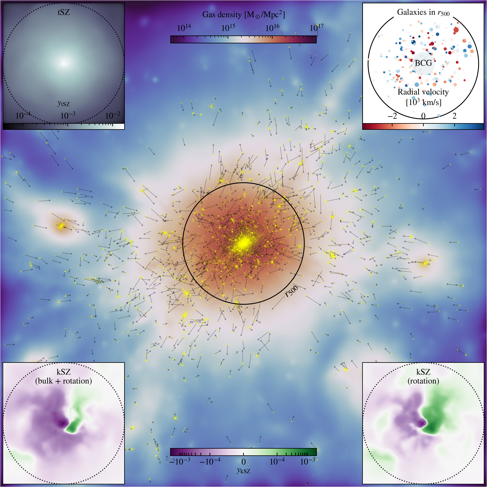

# Rotational kinetic SZ effect in MACSIS clusters

#### Data products from the study by [Altamura et al. (2023)](https://ui.adsabs.harvard.edu/abs/2023arXiv230207936A/abstract)
This repository contains suppelementary material from my publications on the rkSZ effect, and a collection of analysis tools for the MACSIS cosmological simulations. MACSIS is a suite of zoom-in simulations of galaxy clusters run with `Gadget-3` and the BAHAMAS sub-grid model. An overview of the most massive MACSIS cluster is shown below, with the kSZ maps in the insets at the bottom. 

## 📚 Citing
When using data products or code from this repository, and the results or insights derived from it, we recommend citing [Altamura et al. (2023)](https://ui.adsabs.harvard.edu/abs/2023arXiv230207936A/abstract) using the [bibliography styles provided in ADS](https://ui.adsabs.harvard.edu/abs/2023arXiv230207936A/exportcitation).
